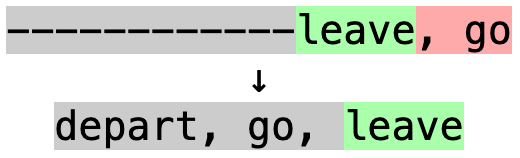
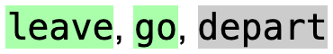
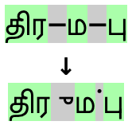

# Answer Set

Answer Set is an [Anki add-on](https://ankiweb.net/shared/info/1827331674)
which gives better feedback for "type in the answer" style cards if there are
multiple correct answers and improves support for Indic scripts.

To install, open Anki and go to Tools > Add-ons in the menu bar, then click
"Get Add-ons..." and enter this code: `1827331674`

## Multiple Answers

If you try to have multiple answers in a "type in the answer" style card in
Anki, you will run into some issues. For instance, if you had "depart, go,
leave" as the answer but typed "leave, go" instead, you would get:



This makes it difficult to see which answers you got correct, and which you
actually did get wrong. With this add-on, the "correct" answers are rearranged
before showing the difference, and so only this would be shown:



This is particularly useful for language learning, since often there will be
multiple words matching a definition or multiple definitions for the same word.

## Improved Support for Indic Scripts

For some languages such as Tamil (தமிழ்), the script requires combining
characters to represent vowels. Here is an example of the diff that Anki gives
by default when typing "திரமபு" (tiramabu) instead of "திரும்பு" (tirumbu):



Separating the combining marks from the letters that they attach to make it
difficult to see what is actually wrong, so this add-on groups combining marks
before showing the difference:


## Syntax

If the "correct" answer contains `;`, then `;` will separate the answer choices
for rearranging. Otherwise, `,` will be used. This means that this:

```txt
a, b, c; d, e, f
```

Will be parsed into `a, b, c` as one answer and `d, e, f` as another.

## Config

There are a few special features which can be enabled/disabled in the add-on
config in Anki:

* [Lenient Validation](doc/lenient_validation.md) *(Enabled by default)*
* [Comments](doc/comments.md) *(Disabled by default)*

## Implementation Details

This add-on is implemented as a monkey patch replacing
`Collection.compare_answer` (Anki 2.1.56+) or `Reviewer.correct` (up to Anki
2.1.54), which are responsible for generating the differences. Since it replaces
these functions, it is not guaranteed to work in future updates. I have tested
it in Anki 2.1.40 through 2.1.65.

The answer rearranging algorithm uses the
[Longest Common Subsequence](https://en.wikipedia.org/wiki/Longest_common_subsequence)
between "given" and "correct" answer choices to determine which correct answer
is closest to which given answer for rearranging. The closest pair is grouped
together first, then the next closest, and so on until there are no more pairs.
Then, combining characters are grouped for the final difference, which then uses
a similar algorithm to the default implementation. Comments are only compared if
they are given when typing the answer in.

## Changelog

2023-12-27:

* Fix bug with alternatives in brackets next to other words.
* Allow whitespace in alternatives when inside of brackets.

2023-12-11:

* Added config option to ignore answer separators in brackets and parentheses.

2023-12-10:

* Changed choice-matching heuristic to maximize correct letters instead of minimizing wrong letters.

2023-11-29:

* Fixed issue with mixing alternatives with other lenient validation options.

2023-11-26:

* Added configuration options in Anki add-on config page.
* Comments are now disabled by default, but can be enabled in config.
* Lenient validation can now be disabled in config.
* Missing periods are now ignored by default, but this can be changed in config.

2023-11-15:

* Added support for optional text in brackets.
* Comments now must have a space immediately before them.

2023-07-13:

* Added support for alternatives separated by slashes.

2023-06-15:

* Fixed handling of HTML tags in expected answer.

## Bugs

If you find a bug, please open an issue in this repository describing the issue.
