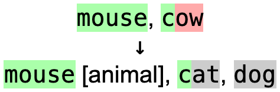
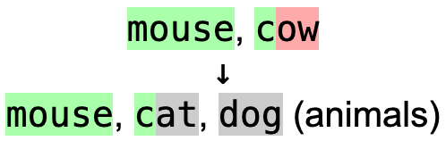

# Answer Set

Answer Set is an [Anki add-on](https://ankiweb.net/shared/info/1827331674)
which gives better feedback for "type in the answer" style cards if there are
multiple correct answers, and improves support for Indic scripts.

Anki 2.1.56 improved the comparison algorithm (the annoying red dashes were
removed thanks to @dae!), so this add-on may be less necessary for Anki 2.1.56+,
but it still provides several other useful features.

## Multiple Answers

If you try to have multiple answers in a "type in the answer" style card in
Anki, you will run into some issues. For instance, if you had "depart, go,
leave" as the answer but typed "leave, go" instead, you would get:


This makes it difficult to see which answers you got correct, and which you
actually did get wrong. With this add-on, the "correct" answers are rearranged
before showing the difference, and so only this would be shown:


This is particularly useful for language learning, since often there will be
multiple words matching a definition or multiple definitions for the same word.

## Improved Support for Indic Scripts

For some languages such as Tamil (தமிழ்), the script requires combining
characters to represent vowels. Here is an example of the diff that Anki gives
by default when typing "திரமபு" (tiramabu) instead of "திரும்பு" (tirumbu):


Separating the combining marks from the letters that they attach to make it
difficult to see what is actually wrong, so this add-on groups combining marks
before showing the difference:


## Syntax

If the "correct" answer contains `;`, then `;` will separate the answer choices
for rearranging. Otherwise, `,` will be used. This means that this:

```txt
a, b, c; d, e, f
```

Will be parsed into `a, b, c` as one answer and `d, e, f` as another.

### Comments

Comments may be added to an answer choice using `[...]`. These comments will not
be checked, so they can be used to add notes to answers. For instance:

```txt
ball [the event], dance
```

Will be parsed as `ball` as one answer with `[the event]` attached as a note,
and `dance` as another answer. For comments which apply to the entire set of
answers, use `(...)` instead. For instance:

```txt
dog, cat, mouse (animals)
```

Would be parsed as `dog`, `cat`, and `mouse` for answer choices, and a general
note of `(animals)` which applies to all of the choices. This is different from
`[...]` because it will not be rearranged when comparing answers. The two styles
may be used in the same card, but cannot be nested.

As an example, if you type "mouse, cow" for `dog, cat, mouse [animal]`:



But if you type "mouse, cow" for `dog, cat, mouse (animals)`:



## Implementation Details

This add-on is implemented as a monkey patch replacing
`Collection.compare_answer` (Anki 2.1.56+) or `Reviewer.correct` (up to Anki
2.1.54), which are responsible for generating the differences. Since it replaces
these functions, it is not guaranteed to work in future updates. I have tested
it in Anki 2.1.40 through 2.1.56.

The answer rearranging algorithm uses the
[Levenshtein Distance](https://en.wikipedia.org/wiki/Levenshtein_distance)
between "given" and "correct" answer choices to determine which correct answer
is closest to which given answer for rearranging. The closest pair is grouped
together first, then the next closest, and so on until there are no more pairs.
Then, combining characters are grouped for the final difference, which then uses
a similar algorithm to the default implementation. Comments are only compared if
they are given when typing the answer in.

## Bugs

If you find a bug, please open an issue in this repository describing the issue.
