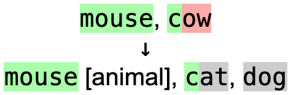
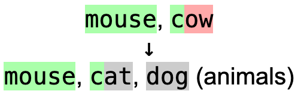

# Comments

Comments are **disabled** by default and must be enabled in the Anki add-on
config page before they can be used. If you want text in brackets or
parentheses to be optional, you likely want to use
[Lenient Validation](lenient_validation.md) instead of comments.

## Answer Choice Comments \[...]

Comments may be added to an answer choice using `[...]`. These comments will not
be checked, so they can be used to add notes to answers. For instance:

```txt
ball [the event], dance
```

Will be parsed as `ball` as one answer with `[the event]` attached as a note,
and `dance` as another answer.

## Answer Comments (...)

For comments which apply to the entire set of answers, use `(...)` instead.
For instance:

```txt
dog, cat, mouse (animals)
```

Would be parsed as `dog`, `cat`, and `mouse` for answer choices, and a general
note of `(animals)` which applies to all of the choices.

## Difference between \[...] and (...)

Answer comments like `(...)` are different from answer choice comments like
`[...]` because they will not be rearranged when comparing answers. The two
styles may be used in the same card, but cannot be nested.

As an example, if you type "mouse, cow" for `dog, cat, mouse [animal]`:



But if you type "mouse, cow" for `dog, cat, mouse (animals)`:



There must always be a space immediately before a comment, or else it will be
treated as part of the answer. For instance, the `(ing)` in `start(ing)` is not
considered a comment.
