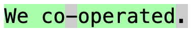
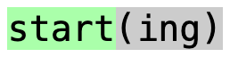
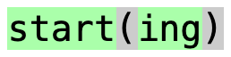
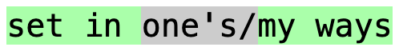

# Lenient Validation

Sometimes you may not want to type out the full answer as it is written on the
card, so if lenient validation is enabled, these cases will not be marked as
errors when checking the answer. Instead, they will just be shown in gray.
Lenient validation is enabled by default, but it can be disabled or customized
in the Anki add-on config page.

## Missing Spaces, Periods, and Hyphens

Since spaces, periods, and hyphens usually aren't important when checking
answers, lenient validation will not show the answer as incorrect when they
are missing. In the Anki add-on config page, you can customize which
characters are allowed to be missing like this.

For example, if you type "We cooperated" for `We co-operated.`, it shows:

## Missing Bracketed Text

Often, there are some words which are not required in an answer, such as text
in square brackets `[...]` or parentheses `(...)`. When lenient validation is
enabled, this text is optional and will not be shown as incorrect if it is
missing. If it is included, the brackets or parentheses are optional as well.

For example, if you type "start" for `start(ing)`, it shows:

And if you type "starting" for `start(ing)`, it shows:

## Missing Alternatives

Sometimes there may be multiple similar words in an answer which are all
correct. If you separate these words with slashes (`/`), lenient validation
will accept any one of them, and will not mark the missing alternatives as
incorrect. Note: if one of the words is a part of the other, make sure to put
it first or it may not always work properly. For instance, use `a/an` instead
of `an/a`, and use `start/starting` instead of `starting/start`.

For example, if you type "set in my ways" for `set in one's/my ways`, it shows:

