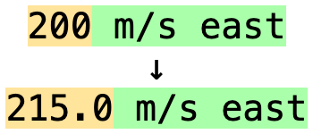
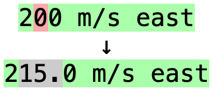
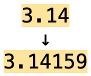

# Numeric Comparison

By default, numbers will by compared by their numeric value rather than by
their digits. This means that if the correct answer is `$1.00`, you could also
answer `$1`, and it will be considered correct. You can customize or disable
this behavior using the Anki add-on config.

## Numeric Comparison Factor

The `"Numeric Comparison Factor"` option in the Anki add-on config page sets
how close to the correct answer numbers need to be for them to be considered
almost correct. For instance, if set to 1.0 (the default), then the numbers
must match exactly in numeric value to be accepted.

If set to 1.25, then if the correct answer is `x`, any number between `x/1.25`
and `x*1.25` will be accepted. Answers within this range that will be shown in
yellow by default to indicate that they are not exactly correct. You may also
use the reciprocal of the factor, so a factor of 0.8 would be exactly
equivalent to a factor of 1.25.

For instance, with a factor of 1.25, if the correct answer is 215.0, then any
number between 172 and 268.75 will be accepted, but shown in yellow:



If the config option is set to 0, then numeric comparisons will be disabled
entirely, meaning that numbers will be compared as strings of digits only. For
instance, if you answer 200 when the correct answer is 215.0:



The comparison factor can be overridden for specific answers by adding the
factor immediately after a number, separated with a question mark (`?`).
For instance, `3.14159?0.999` requires the answer to be between 3.138 and 3.145:



## Styling

To change the color for numbers within the accepted range, you can use the
`typePass` CSS class. The default styling has a background color of `#ffe49b`.
You would likely need to add `!important` to force an override if you change
it. For instance, you could add this styling to your card:

```css
.typePass {
    background-color: #ff0 !important;
}
```
